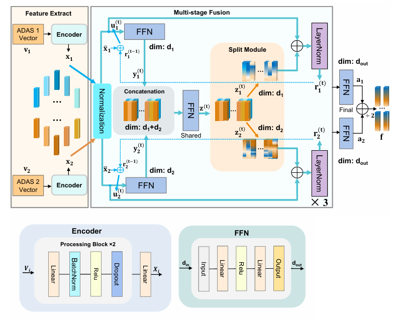
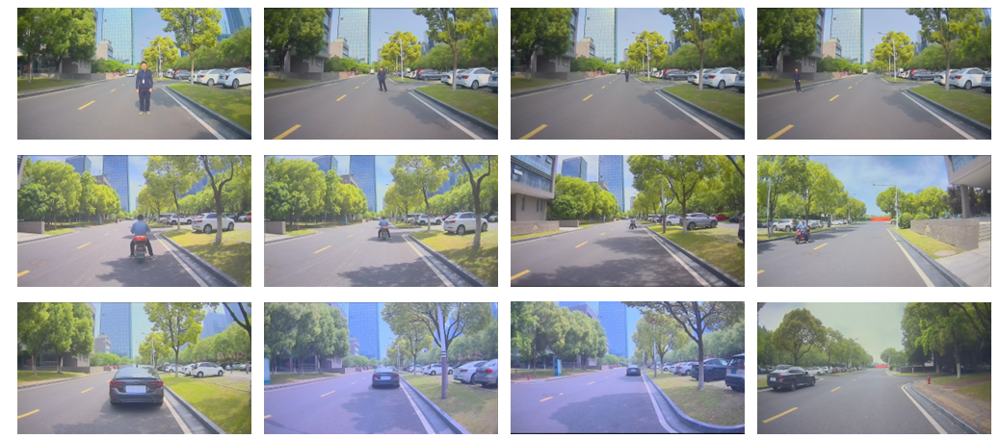

# Multi-Source Fusion Network for ADAS Performance Evaluation

This repository provides the official implementation for the paper **"A multi-source data fusion network for ADAS performance measurement"**. This project introduces a unified, end-to-end deep learning framework designed to reliably evaluate the distance measurement performance of retrofitted Advanced Driver-Assistance Systems (ADAS) in a self-supervised manner.

The core objective is to generate a reliable performance benchmark by fusing data from two potentially imperfect ADAS sources, especially in scenarios where a professional ground truth is unavailable.

## 1. Model Architecture & Introduction

The model is a single, end-to-end network that integrates feature extraction and multi-stage fusion into one seamless architecture.


*Fig. 1: The end-to-end multi-source fusion network architecture.*

The network is composed of three main logical components:

1.  **Parallel Feature Extractors**: Two independent encoders process the input from two different ADAS systems. Each encoder transforms the raw numerical data into a compact, learned feature representation.
2.  **Iterative Fusion Network**: This is the core of the model. It takes the features from the encoders and refines them over several iterative stages. In each stage, it allows for information exchange between the two data streams, encouraging the model to learn cross-modal interactions and complementary information.
3.  **Final Output Generation**: After the iterative fusion process, the two refined feature streams are combined via a weighted average to produce a single, robust, and highly reliable fused feature vector.

## 2. Data Origin and Preparation

It is crucial to understand the data pipeline for this project. The model does not process images directly. Instead, it works with numerical data derived from specialized hardware. The complete data acquisition workflow is illustrated below.


*Fig. 2: The data acquisition and preparation workflow.*

The workflow can be summarized in the following steps:

**Real-World Street Scenes (Video/Images) → Multiple ADAS Devices → Raw CAN Bus Messages → Parsed Numerical Data (.txt files)**

1.  **Original Data Source**: The process starts with capturing real-world driving scenarios as video.
2.  **ADAS Hardware Processing**: These videos are fed into various commercial ADAS devices. The devices' internal algorithms process the images to detect objects and estimate distances. The specific ADAS units used to generate our dataset include:
    *   MAXEYE
    *   MOTOVIS
    *   MINIEYE
    *   ME630
    *   JMS2
    *   JMS3
    *   MIT200
    *   MIT500
3.  **Data Extraction**: Each device outputs its results (like object distance, type, etc.) as messages on a CAN (Controller Area Network) bus. These messages are captured and decoded.
4.  **Input for this Code**: The final decoded data is saved as `.txt` files, which serve as the raw input for the data preparation stage of this project.

## 3. Environment Setup

To run this project, you need to install the necessary Python libraries.

1.  It is recommended to create a virtual environment.
2.  Install the required packages. You can create a `requirements.txt` file with the following content:
    ```
    torch
    numpy
    pandas
    ```
    Then, install them with:
    ```bash
    pip install -r requirements.txt
    ```

## 4. How to Run the Pipeline

The project is designed to be run from a single script: `train_e2e.py`.

1.  **Configure Data Paths**: Before running, open `config.py` and update the `data_path` entries in the `end_to_end` section to point to your two input `.npy` data files.

2.  **Execute the Script**: Run the following command from your terminal. The `train_extract` mode will handle both training the model and generating the final fused result in a single step.

    ```bash
    # This will train the model, save the best version, and then use it to generate the final fused feature.
    python train_e2e.py --mode train_extract
    ```

The final output will be saved as `e2e_self_supervised_results/fused_feature.npy`.

## 5. Performance Analysis

The final output of this pipeline is the `fused_feature.npy` file located in the `e2e_self_supervised_results` directory.

This file represents the **reliable, synthesized performance reference** generated by the fusion model. The next step is to use this result for your performance analysis. You can:

-   Compare the original data from each individual ADAS against this fused result.
-   Calculate performance metrics such as Mean Squared Error (MSE), Mean Absolute Error (MAE), and bias to quantify how much each individual system deviates from the more reliable fused benchmark.
-   This analysis will allow you to quantitatively assess the performance and stability of each ADAS device, achieving the main goal of the project.

## 6. Materials, Methods, and Limitations

This section provides additional details regarding the experimental setup and scope of the study.

### Computing Infrastructure
The model was trained and evaluated on the following infrastructure:
- **Operating System:** Ubuntu 20.04
- **GPU:** NVIDIA GeForce RTX 2080 Ti
- **CPU:** Intel(R) Xeon(R) Gold 6136 CPU @ 3.00GHz (48 Cores)
- **Architecture:** x86_64
- **RAM:** 64 GB
- **Software:** Python 3.8, PyTorch 1.12.1, CUDA 11.3

### Dataset Availability
The raw street scene video data used for this study has been made publicly available in a separate repository. It can be accessed at:
[https://github.com/liumou998/data.git](https://github.com/liumou998/data.git)

The processed numerical data (`.txt` and `.npy` files) used as direct input for the model can be generated from this raw video data by following the acquisition and parsing steps described in our paper.


### Conclusions & Limitations
While our approach demonstrates strong performance, it is important to acknowledge its limitations:
- **Generalization to Unseen Devices:** The model was trained on data from a specific set of eight ADAS devices. Its performance on data from entirely new, unseen ADAS hardware has not been validated.
- **Scenario and Condition Coverage:** The dataset was collected under clear weather and good lighting conditions. The model's robustness in adverse conditions such as heavy rain, snow, fog, or low-light environments requires further investigation.
- **Dependency on Input Quality:** As a self-supervised method, the quality of the fused output is inherently linked to the quality of the input data. In scenarios where both source ADAS systems provide highly erroneous or correlated-error data, the fusion result may be compromised.
- **Vision-Only Modality:** This study is focused exclusively on vision-based ADAS systems. The framework does not incorporate other sensor modalities like Radar or LiDAR, which could provide complementary information, especially in challenging weather conditions.
